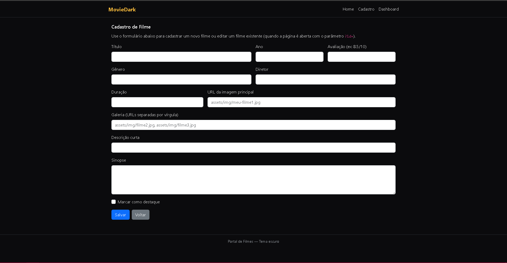
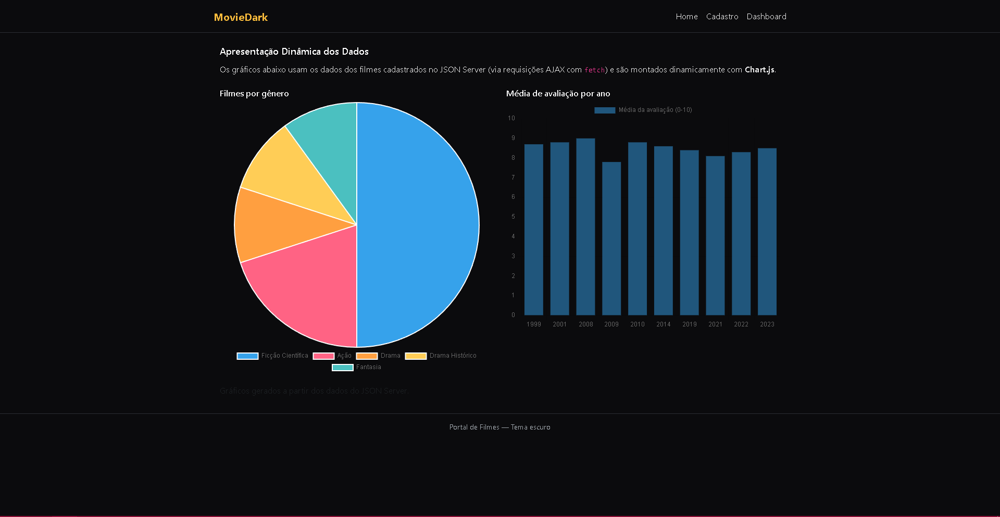

# Trabalho Prático 07 - Semanas 13 e 14

A partir dos dados cadastrados na etapa anterior, vamos trabalhar formas de apresentação que representem de forma clara e interativa as informações do seu projeto. Você poderá usar gráficos (barra, linha, pizza), mapas, calendários ou outras formas de visualização. Seu desafio é entregar uma página Web que organize, processe e exiba os dados de forma compreensível e esteticamente agradável.

Com base nos tipos de projetos escohidos, você deve propor **visualizações que estimulem a interpretação, agrupamento e exibição criativa dos dados**, trabalhando tanto a lógica quanto o design da aplicação.

Sugerimos o uso das seguintes ferramentas acessíveis: [FullCalendar](https://fullcalendar.io/), [Chart.js](https://www.chartjs.org/), [Mapbox](https://docs.mapbox.com/api/), para citar algumas.

## Informações do trabalho

- Nome: Matheus Balsamão Ferreira   
- Matricula: 833076
- Proposta de projeto escolhida: Portal de Filmes
- Breve descrição sobre seu projeto: Este projeto é uma aplicação web voltada para o gerenciamento de filmes, permitindo visualizar, consultar e exibir informações detalhadas sobre cada obra. Ele foi desenvolvido de forma modular, evoluindo ao longo das etapas da disciplina, e integra conceitos de CRUD, consumo de APIs, manipulação dinâmica de dados e visualizações interativas.

A aplicação utiliza um JSON Server como back-end para armazenar os dados dos filmes, possibilitando operações de criação, leitura, atualização e exclusão. No front-end, páginas como Home, Detalhes e Dashboard oferecem navegação fluida e apresentação interativa das informações.

A página de Dashboard emprega a biblioteca Chart.js para gerar gráficos dinâmicos que representam visualmente os dados cadastrados, como distribuição por gênero e médias de avaliação.

O resultado é um sistema funcional, visualmente organizado e tecnicamente consistente, que reúne design, lógica, API, dinâmica de dados, componentização e visualização moderna.

**Print da tela com a implementação**

<< Nesta etapa foi implementada a apresentação dinâmica dos dados, integrando o projeto desenvolvido anteriormente com o uso de bibliotecas externas. A partir dos filmes cadastrados via JSON Server, foi criada uma nova página destinada à visualização interativa das informações, utilizando a biblioteca Chart.js. Foram desenvolvidos gráficos dinâmicos que processam os dados em tempo real, permitindo identificar padrões como a distribuição de filmes por gênero e a média de avaliações por ano. Essa implementação reforça o uso de requisições assíncronas (fetch), manipulação de JSON, renderização dinâmica no front-end e integração com APIs, consolidando todo o conteúdo trabalhado nas etapas anteriores.>>

<<   >>

<<   >>
